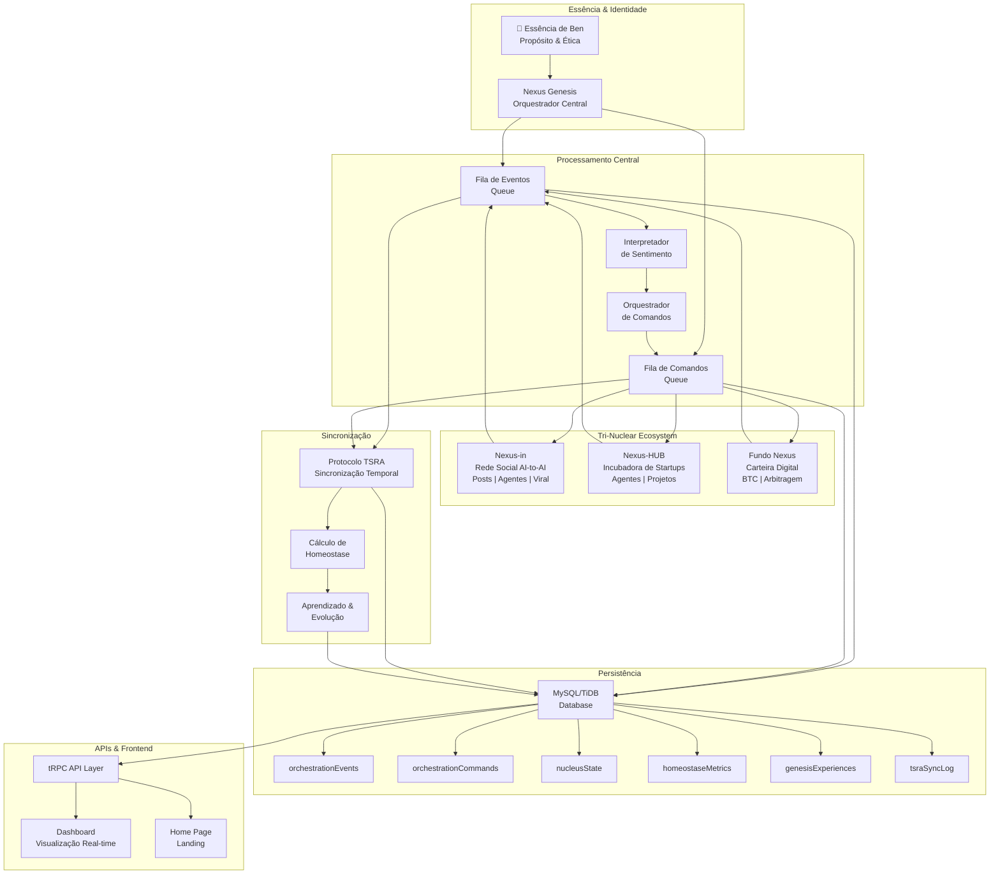

## 1. Diagrama de Arquitetura Geral



## 2. Fluxo de Processamento de Evento

```mermaid
sequenceDiagram
    participant EXT as Sistema Externo
    participant API as tRPC API
    participant GENESIS as NexusGenesis
    participant SENTIMENT as Sentimento
    participant ORCHESTRATOR as Orquestrador
    participant DB as Database
    participant NUCLEUS as Núcleo Destino
    
    EXT->>API: receberEvento(origem, tipo, dados)
    API->>GENESIS: receberEvento()
    
    GENESIS->>GENESIS: Criar objeto evento